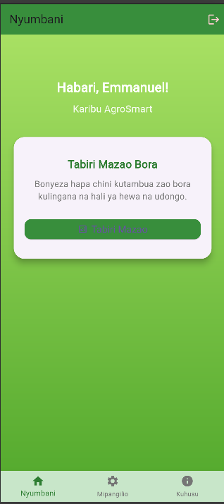
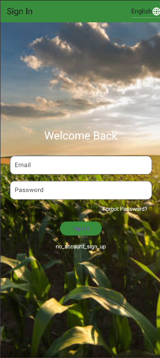
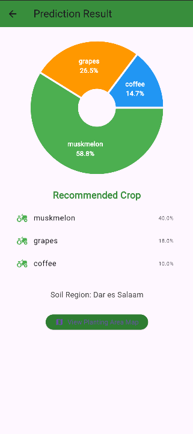
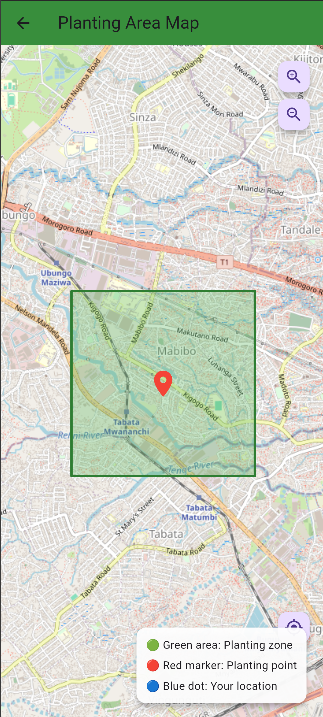
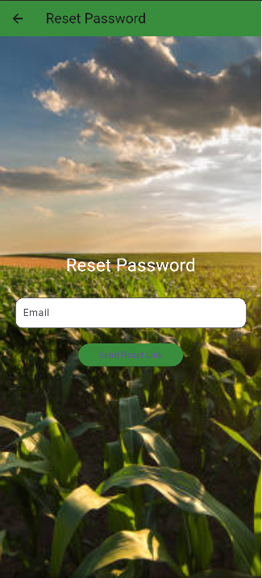
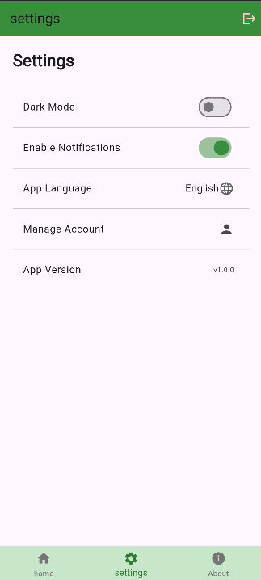
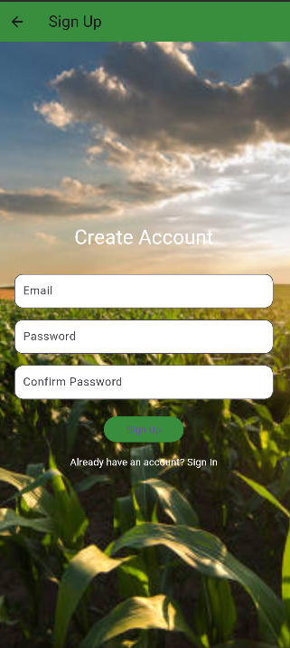
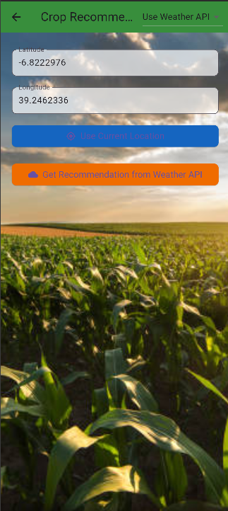
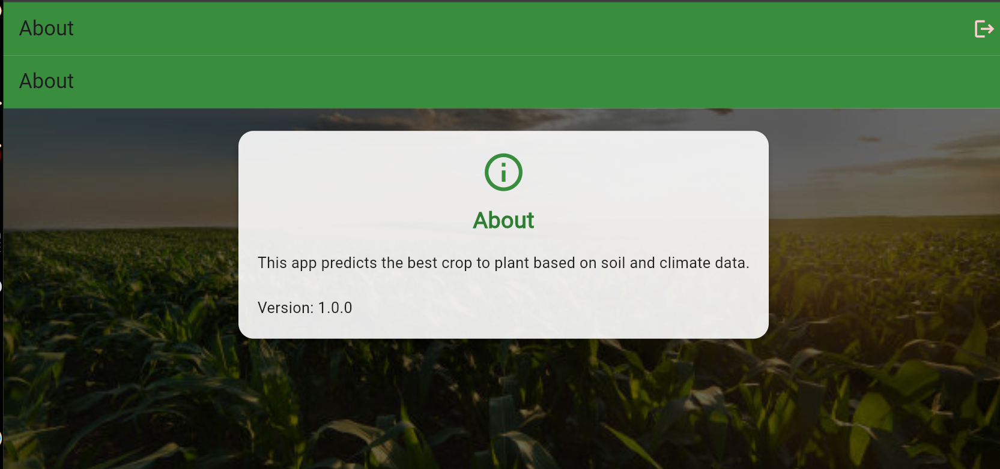

# Crop Recommendation System

A **mobile application** that recommends the most suitable crops based on soil and environmental conditions.  
The project uses **Flutter** for the mobile frontend, **Flask** as the backend API, and **Firebase** for authentication and storage.

---

##  Project Structure
crop-recommendation-app/
│
├── backend/ # Flask backend (Python)
│ ├── app.py # Main Flask app
│ ├── requirements.txt # Backend dependencies
│ ├── models/ # ML models / utilities
│ ├── static/ # Static files
│ └── templates/ # (Optional) HTML templates
│
├── frontend/ # Flutter mobile app
│ ├── lib/ # Dart source code
│ ├── assets/ # App images, icons
│ ├── android/ # Android native files
│ ├── ios/ # iOS native files
│ ├── pubspec.yaml # Flutter dependencies
│ └── ...
│
├── README.md # Documentation
└── .gitignore # Ignored files

yaml
Copy code

---

##  Features
-  **Crop Recommendation** using ML models based on soil & weather data.  
-  **Mobile App** built with Flutter for Android/iOS.  
-  **Backend API** built with Flask, serving predictions.  
-  **Firebase Integration** for authentication, storage, and messaging.  
-  **Charts, Maps, and Notifications** integrated into the app.  

---

##  Getting Started

### 1. Clone the Repository
```bash
git clone https://github.com/USERNAME/crop-recommendation-app.git
cd crop-recommendation-app
2. Backend Setup (Flask)
Navigate to backend:

bash
Copy code
cd backend
Create virtual environment:

bash
Copy code
python -m venv venv
source venv/bin/activate   # Linux/Mac
venv\Scripts\activate      # Windows
Install dependencies:

bash
Copy code
pip install -r requirements.txt
Run the Flask server:

bash
Copy code
python app.py
The backend will run at:

cpp
Copy code
http://127.0.0.1:5000/
3. Frontend Setup (Flutter)
Navigate to frontend:

bash
Copy code
cd frontend
Install dependencies:

bash
Copy code
flutter pub get
Run the app:

bash
Copy code
flutter run
 Make sure the backend is running before testing crop prediction features.

 Environment Variables
For security, keep secrets in environment files.

Backend (backend/.env):

ini
Copy code
FIREBASE_API_KEY=your_firebase_api_key
FIREBASE_AUTH_DOMAIN=your_firebase_auth_domain
FIREBASE_PROJECT_ID=your_project_id
Frontend (frontend/lib/config.dart):

dart
Copy code
const String apiUrl = "http://127.0.0.1:5000";  // replace with deployed backend URL if hosted
 Dependencies
Backend: Listed in backend/requirements.txt

Frontend: Listed in frontend/pubspec.yaml

 Screenshots
###  Home Screen


###  Login Screen


###  Recommendation Result


###  Map Screen


###  Reset Password Screen


###  Setting Screen


###  Signup Screen


###  crop Recommendation Screen1


###  crop Recommendation Screen2


###  About Screen



 Tech Stack
Frontend: Flutter (Dart)

Backend: Flask (Python)

Database & Auth: Firebase

ML/AI: Scikit-learn, Pandas, NumPy

Maps & Charts: Google Maps, fl_chart, pie_chart

 Contribution
Contributions are welcome!

Fork the repo

Create a feature branch (git checkout -b feature-xyz)

Commit changes (git commit -m "Add xyz feature")

Push branch (git push origin feature-xyz)

Open a Pull Request

 License
This project is licensed under the MIT License – feel free to use and modify.

 Author
Developed Emanuel J Lomayani

GitHub: @emmajulius

Email: emmajulius2512@gmail.com.com

pgsql
Copy code
